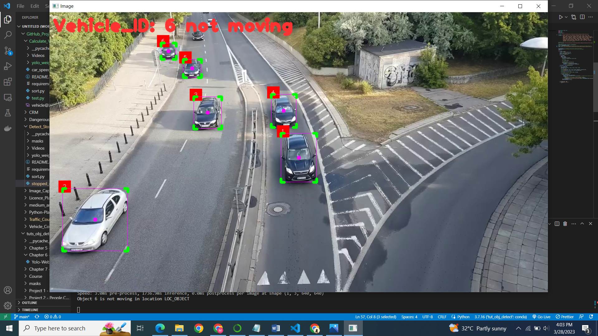

# Detect Stopped vehicles In Video

Hi,

In this repo, You will see how to detect vehicles that stopped in a given video.

## Step 1:
Install all requirements
`pip install -r requirements.txt`

## Step 2: Run the `python` file
`python stopped_car_detect.py`

### Side Notes:
1. I want to add the functionality to save images of vehicles that have stopped into a folder.
2. I want to dockerize this file
3. Change the image on the readme file

